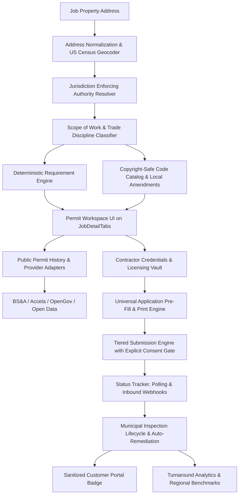

# Let's Get Quoted — Permit & Local Codes Intelligence System Architecture

## Overview & Mission
The **Permit & Local Codes Intelligence Engine** is a comprehensive subsystem built natively into Let's Get Quoted. It eliminates permit research friction, accelerates municipal turnaround times, automates document compilation, protects contractors with strict consent gates, tracks inspection lifecycles, and instills trust with homeowners.

---

## High-Level System Architecture



---

## 1. Core Domain Subsystems

### A. Location Context & Geocoding (`src/lib/location-context/`)
- **`normalize-address.ts`**: Normalizes free-text US street addresses into parsed components (street number, street name, unit/apt, city, state abbreviation, zip code).
- **`census-geocoder.ts`**: Queries the public US Census Bureau Geocoding API (`geocoding.geo.census.gov`) to obtain county FIPS, Census tract, block, and Minor Civil Division (MCD) data.
- **`jurisdiction-resolver.ts`**: Resolves the exact municipal enforcing authority per trade discipline mapped against Michigan LARA BCC guidelines (City of Royal Oak, Detroit BSEED, Grand Rapids, Ann Arbor, Oakland Twp).

### B. Code Catalog & Requirement Engine (`src/lib/permit-intel/`)
- **`code-catalog.ts`**: Curated, copyright-safe code adoptions and plain-language summaries:
  - **Building & Roofing**: 2015 Michigan Residential Code (MRC) (§ R905.1.2 Ice Barriers, § R908.3 Re-roofing, § R905.2.8.5 Drip Edge).
  - **Electrical**: 2023 National Electrical Code (NEC / MEC Part 8) (Art. 230.70 Service Disconnects, Art. 625.40 EV Chargers).
  - **Mechanical / HVAC**: 2021 Michigan Mechanical Code (MMC) (M1401.3 ACCA Manual J/S Sizing, M1601.4.1 Duct Sealing).
  - **Plumbing**: 2021 Michigan Plumbing Code (MPC) (P2804.6.1 Water Heater T&P Relief, P2902.5.3 Backflow Prevention).
- **`requirement-engine.ts`**: Deterministic rule evaluator returning `required`, `not_required`, or `verify` with citations, document submittal requirements, inspection milestones, and government fee estimates.

### C. Provider Adapters & Public Permit History (`src/lib/permit-intel/providers/`)
- **`bsa.ts`**: BS&A / AccessMyGov adapter resolving municipal UID endpoints and deep search links.
- **`accela.ts`**: Accela Citizen Access adapter for larger metropolitan areas.
- **`opengov.ts`**: OpenGov PLC portal adapter.
- **`open-data.ts`**: Socrata and ArcGIS open dataset adapter (e.g. Detroit BSEED open permit records).
- **`manual-link.ts`**: Universal fallback adapter.

### D. Form Compiler & Submission Engine (`src/lib/permit-intel/`)
- **`application-generator.ts`**: Compiles contractor credentials, homeowner information, parcel data, technical specifications, and Michigan § 23a legal notices into printable HTML application packets.
- **`submission-pipeline.ts`**: Evaluates readiness across submission tiers (`Tier 0` to `Tier 4`), strictly enforcing idempotency and explicit contractor authorization before executing any submittal.

### E. Municipal Inspection Lifecycle (`src/lib/permit-intel/inspection-service.ts`)
- Initializes required trade milestones (Rough Building, Ice Barrier, Open Wall, Final Inspection).
- Records pass/fail results with inspector notes.
- Automatically generates remediation tasks in `job_tasks` upon inspection failure.
- Closes and finalizes the permit case upon passing the final inspection.

### F. Automated Polling & Webhook Tracking (`src/lib/permit-intel/status-tracker.ts`)
- Municipal status tracker polling provider adapters.
- Inbound webhook router (`/api/webhooks/permits/[provider]`) supporting secret verification for instant status transitions.

### G. Contractor Credentials & Licensing Vault (`src/lib/permit-intel/credentials-vault.ts`)
- Stores Builder licenses, Master trade licenses, Municipal portal PINs, and Insurance policies with real-time expiration monitoring (`active`, `expiring_soon`, `expired`).

### H. Homeowner Transparency (`src/lib/permit-intel/customer-portal.ts`)
- Sanitized, customer-safe permit status badge and milestone timeline.
- Strictly strips private contractor PINs, profit margins, and internal checklists.

### I. Performance Analytics & Regional Benchmarks (`src/lib/permit-intel/permit-analytics.ts`)
- Computes approval turnaround velocity, first-time inspection pass rates, municipal fee totals, and regional benchmark comparisons.

---

## 2. Database Schema & RLS Policies

```sql
-- job_permit_cases
CREATE TABLE public.job_permit_cases (
  id UUID PRIMARY KEY DEFAULT gen_random_uuid(),
  account_id UUID NOT NULL REFERENCES public.accounts(id) ON DELETE CASCADE,
  job_id UUID NOT NULL REFERENCES public.jobs(id) ON DELETE CASCADE,
  authority_id TEXT NOT NULL,
  application_status TEXT NOT NULL DEFAULT 'not_started',
  external_permit_number TEXT,
  submission_tier TEXT NOT NULL DEFAULT 'tier_0',
  submitted_at TIMESTAMPTZ,
  issued_at TIMESTAMPTZ,
  closed_at TIMESTAMPTZ,
  created_at TIMESTAMPTZ NOT NULL DEFAULT now(),
  updated_at TIMESTAMPTZ NOT NULL DEFAULT now(),
  UNIQUE(account_id, job_id)
);

-- job_permit_documents
CREATE TABLE public.job_permit_documents (
  id UUID PRIMARY KEY DEFAULT gen_random_uuid(),
  account_id UUID NOT NULL REFERENCES public.accounts(id) ON DELETE CASCADE,
  job_id UUID NOT NULL REFERENCES public.jobs(id) ON DELETE CASCADE,
  permit_case_id UUID REFERENCES public.job_permit_cases(id) ON DELETE CASCADE,
  document_type TEXT NOT NULL,
  title TEXT NOT NULL,
  storage_path TEXT NOT NULL,
  file_size_bytes INTEGER,
  mime_type TEXT,
  created_at TIMESTAMPTZ NOT NULL DEFAULT now()
);

-- job_permit_inspections
CREATE TABLE public.job_permit_inspections (
  id UUID PRIMARY KEY DEFAULT gen_random_uuid(),
  account_id UUID NOT NULL REFERENCES public.accounts(id) ON DELETE CASCADE,
  job_id UUID NOT NULL REFERENCES public.jobs(id) ON DELETE CASCADE,
  permit_case_id UUID REFERENCES public.job_permit_cases(id) ON DELETE CASCADE,
  inspection_type TEXT NOT NULL,
  status TEXT NOT NULL DEFAULT 'pending',
  scheduled_date DATE,
  completed_date DATE,
  inspector_name TEXT,
  notes TEXT,
  created_at TIMESTAMPTZ NOT NULL DEFAULT now(),
  updated_at TIMESTAMPTZ NOT NULL DEFAULT now()
);

-- contractor_credentials
CREATE TABLE public.contractor_credentials (
  id UUID PRIMARY KEY DEFAULT gen_random_uuid(),
  account_id UUID NOT NULL REFERENCES public.accounts(id) ON DELETE CASCADE,
  credential_type TEXT NOT NULL,
  trade_discipline TEXT NOT NULL DEFAULT 'building',
  license_number TEXT,
  issuing_authority TEXT NOT NULL,
  authority_id TEXT,
  contractor_pin TEXT,
  holder_name TEXT NOT NULL,
  policy_number TEXT,
  insurance_carrier TEXT,
  coverage_amount NUMERIC(12, 2),
  expires_at DATE,
  status TEXT NOT NULL DEFAULT 'active',
  created_at TIMESTAMPTZ NOT NULL DEFAULT now(),
  updated_at TIMESTAMPTZ NOT NULL DEFAULT now()
);
```

---

## 3. Complete API Catalog

| Method | Endpoint | Description | Security |
| :--- | :--- | :--- | :--- |
| `GET` | `/api/jobs/:id/permits` | Get full permit intelligence dossier | `jobs.read` / Owner |
| `POST` | `/api/jobs/:id/permits/workflow` | Update lifecycle status or record fee | `jobs.write` / Owner |
| `GET` | `/api/jobs/:id/permits/history` | Lookup prior public permit history | `jobs.read` / Owner |
| `GET` | `/api/jobs/:id/permits/application` | Generate prefilled application data | `jobs.read` / Owner |
| `POST` | `/api/jobs/:id/permits/submit` | Execute authorized permit submission | `jobs.write` / Owner + Consent Gate |
| `GET` | `/api/jobs/:id/permits/inspections` | List inspection milestones | `jobs.read` / Owner |
| `POST` | `/api/jobs/:id/permits/inspections` | Schedule inspection or log result | `jobs.write` / Owner |
| `POST` | `/api/jobs/:id/permits/sync` | Manually poll municipal portal | `jobs.write` / Owner |
| `POST` | `/api/webhooks/permits/:provider` | Receive municipal status webhooks | Secret Header |
| `GET` | `/api/contractor/credentials` | List vault licenses, PINs & insurance | `jobs.read` / Owner |
| `POST` | `/api/contractor/credentials` | Save or update credential | `jobs.write` / Owner |
| `DELETE` | `/api/contractor/credentials/:id` | Delete credential from vault | `jobs.write` / Owner |
| `GET` | `/api/jobs/:id/permits/customer` | Homeowner-safe permit tracking | Authenticated |
| `GET` | `/api/contractor/permits/analytics` | Turnaround times & regional benchmarks | `jobs.read` / Owner |
| `GET` | `/api/permits/health` | System health check & diagnostics | Public Diagnostics |

---

## 4. Legal & Regulatory Compliance

1. **Michigan Public Act 230 § 23a**: All generated permit applications include mandatory statutory notice warning that working with unlicensed contractors violates state law.
2. **Copyright Protection**: Code catalogs store citations and plain-language guidance, never raw uncredited book scans.
3. **Explicit Consent Safeguard**: Submissions can never be triggered automatically without affirmative contractor consent.
4. **Data Isolation**: Multi-tenant Row-Level Security ensures contractor PINs and internal job costs are strictly partitioned.
