**Business cards: implementation plan for fast, confident ordering through Printful**

Prepared September 5, 2026. Repository reviewed at `482fafb7f`, including the merchandise studio changes in `fe77d3ccd`. This is a proposed implementation plan, not a record of completed changes. The user confirmed Printful as the existing fulfillment provider. Live account catalog access, negotiated costs, webhook configuration, and physical output have not been verified in this planning task.

**1. Make the offer “Your business cards are already designed.”**

The product should turn existing LGQ business information into a card someone can confidently purchase in a few minutes. The default experience is a finished, personalized product with a short review, quantity selection, and checkout. Detailed design controls remain available on demand.

The purchase promise is: “Your logo, your details, and a QR code customers can scan to contact or book you.” Use “book you” only when the selected destination actually supports booking. The service earns its margin through saved setup time, reliable printing, and easy reordering. Conversion improvement is a hypothesis to measure; “instant sell” is the product objective, not a guaranteed sales outcome.

Launch with one verified Printful card product, one supported stock/finish, three curated layouts, and US delivery. Default to 100 cards. Offer 50 and 250 if the connected catalog supports the required pack combinations; put larger quantities under “More quantities.” Keep existing order history accessible. Move NCR pads and other products out of this purchase path until their own fulfillment capabilities are verified, and reject unsupported products on the server as well.

**2. Correct the product definition before setting the offer.**

Printful currently lists its Set of Business Cards in 50- and 100-card packs, with uncoated paper and single- or double-sided printing. Its product page identifies Mohawk paper for the US and Munken Lynx for Europe. These are the starting capabilities to verify in the connected account, not evidence for the current velvet, foil, chrome, holographic, or Spot-UV promises. [Printful product listing](https://www.printful.com/custom/stationery/personalized/set-of-business-cards?productId=724&productSlug=set-of-business-cards)

Printful's public business-card page quotes $18.31 for 100 cards and about $91.55 for 500, or $82.50 for 500 with Growth. Those are public reference prices, not this account's verified production costs. At the public regular figure, the existing $85 retail tier is already $6.55 below product cost, before other expenses. Obtain authenticated, destination-appropriate quotes before retaining any existing retail tier. [Printful public pricing reference](https://www.printful.com/business-cards)

| Observed local condition | Required outcome | Priority |
| --- | --- | --- |
| `biz_cards` falls through to default variant `4014` | Explicit, verified business-card variant mapping; missing mappings stop checkout | Release blocker |
| Broker branch returns only simulated card orders | Route real business cards through the existing Printful integration | Release blocker |
| `quantity` represents cards in LGQ but supplier products are packs | Separate card count, pack size, and provider quantity throughout quoting and fulfillment | Release blocker |
| Provider payload contains the logo alone | Submit complete front and back production files in the selected variant's supported file slots | Release blocker |
| `CardQrVisual` draws a fixed pattern | Generate, render, decode, and physically test a real URL-encoding QR | Release blocker |
| Proof export can fail without stopping checkout | Paid orders require a persisted, valid, approved production revision | Release blocker |
| Fixed ratings, review counts, credentials, and specifications enter designs | Remove them; show only user-confirmed business data and verified product facts | Release blocker |
| Finish choices do not affect supplier capability or tier cost | Remove unsupported finishes from UI, renderer, validation, and old draft conversion | Release blocker |
| Success URL and receipt imply manufacturing immediately | Report confirmed payment and provider state separately | Release blocker |
| Large header, duplicated selectors, and technical panels bury the card | Put the personalized card, price, and primary CTA in the initial viewport | Conversion priority |

**3. Define the first screen around a purchase decision.**

Desktop layout: a compact heading above a large, neutral preview panel on the left and a concise order panel on the right. Keep the familiar LGQ navigation and accent color, while using a calm surface around the artwork so its colors are easy to judge. Show front and back together. The order panel remains visible while reviewing the card.

Mobile layout: heading, front/back preview, quantity choices, short details, then optional customization. A sticky bottom action shows the selected quantity, current price state, and primary CTA without covering content. Both sides must be easy to inspect without dragging a 3D object or finding a horizontal toolbar.

| Element | Proposed behavior or copy |
| --- | --- |
| Heading, complete business profile | “Your business cards are ready.” |
| Heading, missing required details | “Finish your business cards.” |
| Supporting copy | “Made with your logo and business details. Check both sides, choose your quantity, and we’ll print and ship them.” |
| Preview | Large flat front and back; enlarge either side; accurately represent uncoated stock |
| Default quantity | 100 cards, explicitly selected |
| Quantity labels | “50 cards,” “100 cards,” “250 cards”; no “Most popular” badge without actual evidence |
| Product facts | Double-sided printing, verified stock, actual finished size, and QR destination |
| Primary action | “Review my cards” |
| Secondary action | “Edit details” |
| Optional design controls | “Choose another design” and “More design options” |
| Shipping | Cost/estimate labeled honestly before address; exact offered shipping price after validation |
| Final action before Stripe | “Continue to secure payment” with the payable pre-tax amount |
| Returning customer | Last purchased design thumbnail and “Order again” above new-design options |

Remove the large empty hero area, manufacturing lab terminology, repeated template/finish bars, free-shipping progress meter, blanket rush claims, and cart-first framing from the default screen. Keep finish effects out of previews when they cannot be manufactured. A 3D view may return later as a secondary preview generated from the same artwork, but it is not required for launch.

Acceptance: at 390 × 844 and 1440 × 900, the first view communicates whose card it is, the selected quantity, the price state, and the next action. No horizontal page overflow at 320px. Keyboard navigation, visible focus, descriptive radio labels, modal focus return, touch targets of at least 44px, reduced motion, and readable contrast are required. Test in both existing LGQ themes and at 200% zoom.

**4. Prefill a good design without inventing business information.**

Use an existing saved card draft first, then the current confirmed business identity. Prefer the business's uploaded/site logo over an unused AI concept. Make AI artwork an explicit alternative. If no logo exists, render a clean company-name layout immediately and offer an optional upload; absence of a logo should not force an AI generation workflow.

Provide three layouts: Clean (logo and clear contact details), Bold (a restrained brand-color block), and Booking (a prominent working QR). Recommend a layout from observed trade/brand data, but do not change services, credentials, phone number, or tagline when switching layouts. Preserve layout-independent details.

The front emphasizes company name, logo, a short confirmed service description, and a primary contact method. The back provides additional contact details and a QR with a literal action such as “Scan to request a quote.” Allow optional person name, role, email, and license details; do not require them all. No manufacturer specifications, “master builder” badges, fixed star ratings, stock review counts, or unsupported insurance claims appear on customer artwork.

Text fit is a print constraint, not a silent auto-shrink feature. Use a design target of at least 8pt for secondary text and 10pt for primary contact text, subject to physical sample review. If content does not fit, offer a shorter version, fewer fields, or another layout. Do not silently truncate an actual business name, URL, phone number, or credential.

Acceptance fixtures: long business name, long URL, no logo, transparent logo, raster logo with a background, long service description, missing phone, international characters, and punctuation. Every fixture has readable output or a specific actionable validation message. Reset restores confirmed profile data and clearly signals the change.

**5. Give the customer a short, recoverable purchase sequence.**

1. See the prepared card and select quantity; optional edits stay on the same screen.
2. Review a large front and back proof. Show contact details as readable text alongside the images. Offer “Open QR destination” and “Edit details.”
3. Approve the actual saved artwork revision with one unchecked-by-default checkbox: “I’ve checked both sides and my details are correct.” Keep existing applicable order terms accessible with concise wording.
4. Confirm delivery information once, obtain shipping options, and show the complete order recap before payment. Reuse an existing legitimate shipping address when available, while allowing changes.
5. Complete Stripe Checkout. Eligible wallets can appear where supported; do not promise availability on every device.
6. Return to an order page that reads server-confirmed payment and fulfillment state. Preserve the draft after cancellation or failure, and show a safe retry/resume action.

Editing artwork invalidates its approval. Changing quantity or delivery details invalidates the commercial quote and any obsolete checkout session, but need not invalidate unchanged artwork approval. Approval is scoped to the order's immutable revision, not whichever design happens to be visible in an editor. A reorder uses the saved printed revision, obtains a new quote, and asks the customer to review the current destination and details before payment.

Keep the first release to one design per order. Preserve old multi-item order history, and detect old carts explicitly instead of silently omitting their items. Team-member batches and mixed merchandise orders can follow after the single-design flow is reliable.

**6. Make Printful catalog verification the first technical work package.**

Reuse existing server-side credentials and store configuration. Start with read-only requests for the connected store's eligible business-card product, variants, availability, pack sizes, file slots, template dimensions, and costs. The public product URL identifies product `724`; verify that catalog identity before binding it, and do not confuse a product ID with a variant ID.

Record a versioned capability configuration: provider/store, product ID, supported variants, cards per pack, currency, destination support, print sides, required files, template/bleed/safe-area specifications, availability, and verification timestamp. Cache non-personal catalog data appropriately; revalidate availability and cost at quote time. Do not place live credentials or buyer information in fixtures.

Represent card count separately from supplier line quantity. For example, 100 cards may mean one 100-card pack; 250 may mean two 100-card packs and one 50-card pack. Resolve the best supported combination using current costs and supported shipping behavior, then persist that exact pack plan. Both sides of every pack must use the same approved design. Never send a requested count of 100 as 100 packs.

Remove the generic fallback variant for card orders. Missing, discontinued, unavailable, or region-ineligible variants return a clear unavailable state with a saved draft. Production rejects simulation flags and test-token shortcuts before any customer can pay.

Acceptance: authenticated catalog evidence and a fixture-backed contract test agree on the selected product, variants, pack interpretation, and file slots. No paid-provider confirmation is part of this discovery step.

**7. Use one artwork pipeline for preview, approval, and printing.**

Create a versioned `CardDesignDocument` describing actual content, layout, fonts, colors, logo asset/version, QR target, and the validated product template. Generate deterministic front and back artwork from this document. The browser's flat preview and the server's production export must share the same layout definitions; do not separately reconstruct the design in CSS and a decorative canvas report.

Generate the provider-required files at its exact template size and accepted format/color profile. Retrieve those requirements from Printful; do not reuse another printer's bleed, CMYK, PDF, or crop-mark assumptions. Use approved/licensed fonts and include all needed glyphs. Keep physical trim and safe-area units explicit. A two-page customer PDF is optional and must be derived from the same approved artwork; a PNG technical spec sheet is not a substitute for production files.

Validate logo resolution at its placed print size, file format, dimensions, image decoding, text fit, contrast, safe areas, and QR readability. Bound upload size and parsing resources. Sanitize or safely rasterize SVG uploads; prevent external references and arbitrary remote URL fetching. Existing proxy safeguards are useful but do not establish ownership of an uploaded asset.

Persist immutable files and checksums before approval. Store object keys rather than temporary URLs as canonical references. Use private account-scoped storage; provide Printful time-limited retrieval URLs with sufficient processing/retry duration, then retain its processed file identifiers. Renew URLs safely if needed. Wait for provider file validation before checkout readiness, with a recoverable progress state. No base64 data URI, browser-only blob URL, or missing file may become a printable order.

Acceptance: approved file hashes equal the files attached to the Printful order. Every order contains complete, correctly oriented front and back artwork. Export failure blocks purchase, and later logo/profile edits cannot change a paid order's files.

**8. Turn the QR into a durable, useful product feature.**

Use the already installed `qrcode` package for production artwork and `jsqr` for independent decode tests. Do not copy the decorative `CardQrVisual` pattern. The separate custom generator in `src/lib/qrcode.ts` should not be adopted without validation; its SVG helper currently adds only a two-module margin. DENSO's guidance requires four modules around a standard QR symbol. [QR quiet-zone guidance](https://www.qrcode.com/en/howto/code.html)

Prefer a short, stable, LGQ-owned URL using the existing `/r/[code]` concept. Bind it to a confirmed public website, quote-request page, or booking page. Show the exact destination to the buyer. Do not guess domains from company names or substitute the site homepage while labeling it as booking. If no valid destination exists, offer a card without QR or guide the customer to an existing valid page.

Printed short codes must never be recycled. Changes to a customer's website should be handled with a controlled redirect-target update, an audit entry, and ownership checks. Prevent ordinary tracking-link deletion from breaking printed cards. Define account closure/domain loss behavior before launch, and do not market “lifetime QR” without an actual supported policy.

Replace the existing read/increment/write scan counter with an atomic update or durable event ingestion. Do not rely on an unawaited serverless promise to persist scans. A failed analytics write should not break an otherwise valid redirect. Validate redirect protocols/destinations and keep public links free of contact PII or private record identifiers.

Acceptance: decode the final rasterized front/back files, not merely a generated QR in isolation. Test codes on physical samples with iOS and Android at the intended size and in ordinary lighting. Track estimated scans separately from unique people; only claim leads or revenue where an actual attribution chain exists.

**9. Rebuild pricing from actual supplier economics.**

Keep all new quote calculations in integer cents. Persist a quote containing currency, exact pack plan, product/printing cost, provider shipping service/cost, retail items, customer shipping charge, taxes where known, quote version, expiration, and destination fingerprint. Client-side values are display-only.

Contribution per order = customer revenue excluding collected sales tax minus supplier product/printing costs, actual supplier shipping, nonrecoverable supplier taxes, payment fees, and an agreed support/reprint allowance. Do not subtract a notional platform take-rate twice or describe it as an actual transfer. Keep customer sales tax distinct from revenue. Replace the hardcoded $0.05 base-card assumption and reconcile estimated costs against actual provider charges.

Recommended starting pricing policy for validation: seek both at least $10 contribution per order and 30% contribution margin after variable costs. These are proposed business targets, not verified achievable margins. If a tier cannot meet the adopted policy at an acceptable customer price, revise or remove it rather than inventing wholesale discounts. Compare the 50-, 100-, 250-, and 500-card offers using account quotes before deciding final retail amounts.

Show “Shipping calculated after address” before a precise address is available, or an explicitly labeled estimate. After address validation, present offered shipping costs and a delivery window that distinguishes production from transit. Keep taxes labeled until Stripe calculates them. Only promise free standard shipping if a funded, destination-bounded policy supports it. Remove the current $150 upsell meter from the primary flow.

For launch, keep standard shipping as the default and add expedited options only when actually quoted for the selected packs/address. Requote before payment. If provider costs rise after a customer pays, never silently charge more: absorb an allowed variance or put the order in a staffed resolution path. Define the variance cap before launch.

Acceptance: negative, fractional, zero, excessive, and unsupported card quantities are rejected. Arbitrary client totals, finishes, product IDs, and pack sizes cannot affect server prices. Quotes expire cleanly, quantity/address changes reprice, and discounts never bypass the margin or capability rules.

**10. Keep one shipping address and one authoritative checkout quote.**

Retain hosted Stripe Checkout for the first release, with address and shipping selection in LGQ before payment. Avoid asking for shipping details again on Stripe. Use an order-scoped merchandise Stripe Customer with the confirmed shipping address for tax calculation; do not mutate a shared subscription customer's address or share one mutable shipping customer across concurrent orders. Associate the customer with the checkout operation so retries reuse it.

Stripe supports using an existing customer's saved shipping address for automatic tax when Checkout does not collect a new shipping address. Verify this behavior with the installed SDK/API version in test mode, including eligible wallets and billing-address requirements. [Stripe Tax address precedence](https://docs.stripe.com/tax/checkout)

Offer the single selected shipping charge in Checkout and persist its provider service ID. Any shipping edit returns through LGQ to reprice and recreate/expire the relevant session. Fulfillment reads this accepted order quote rather than a stale `shipping_method` metadata value. The final paid amount and tax come from verified Stripe state.

Create the pending order/checkout operation before calling Stripe. Use a stable idempotency key for the same attempt and parameters; a materially changed quote gets a new attempt after resolving the old one. Handle a Stripe timeout by recovering the same session, not creating a new payable order. [Stripe idempotent requests](https://docs.stripe.com/api/idempotent_requests)

Server validation rechecks account membership and purchase permission, ownership of the design/proof, approval hash, quote currency/amount, destination, pack plan, and provider readiness. Require `settings.write` initially to preserve existing purchase authorization, or explicitly introduce a dedicated merchandise purchase permission with corresponding policy coverage.

The return page looks up a session associated with the signed-in account and displays server-confirmed state. `order_success=true` is navigation context only. Browser refresh, Back, duplicate clicks, cancellation, and expired sessions must not lose a draft or create an extra purchase.

**11. Make payment and fulfillment recoverable operations.**

Separate payment, provider-order, shipment, and customer-support state. Proposed payment values: pending, paid, failed, cancelled, partially refunded, refunded, disputed. Proposed fulfillment values: not submitted, queued, submitting, provider draft, accepted, in production, partially shipped, shipped, delivered, on hold, failed, cancelled. Map these to a small, clear customer timeline; keep legacy status available during migration.

The Stripe webhook transaction records the payment result and inserts a uniquely keyed fulfillment job. A worker submits the immutable order. Use a database-backed claim/lease rather than a status read alone to prevent concurrent workers. Existing fulfillment-attempt records become an audit trail with retry count, next attempt time, provider request reference, and redacted error information. Reuse the repository's durable inbox/worker conventions after checking their contracts, rather than adding a separate external queue service by default.

```mermaid
flowchart LR
  A[Approved artwork + valid quote] --> B[Pending order]
  B --> C[Stripe payment]
  C --> D[Verified paid event]
  D --> E[Durable fulfillment job]
  E --> F[Printful draft + file validation]
  F --> G[Explicit provider confirmation]
  G --> H[Provider accepted]
  H --> I[Production and shipment updates]
  I --> J[Tracking and reorder]
```

Use stable Printful external order references. On uncertain creation/confirmation responses, look up and reconcile the existing provider order before retrying. Never blindly resubmit an order after a timeout. Provider draft creation and confirmation are distinct operations; confirmation can charge the store's funding method. Model and test them separately, then allow confirmation only for a verified paid order with valid assets and costs. [Printful order API](https://developers.printful.com/docs/)

Provider failure after payment is an explicit support/retry state, not a return to “proof approved.” A receipt says “Payment received” until provider acceptance is known. Only describe production, shipping, or delivery when supported by actual provider/carrier evidence. Do not equate Printful's `fulfilled` status with physical delivery. Supplier refunds do not automatically mean a customer has been refunded through Stripe.

Stripe can deliver repeat and concurrent fulfillment events; test the whole effect, not just event-ID deduplication. Exactly one intended customer payment and supplier order is the outcome to enforce through unique records and reconciliation. [Stripe fulfillment guidance](https://docs.stripe.com/checkout/fulfillment)

**12. Align webhooks with the configured Printful API version.**

The current webhook expects custom secret headers or `x-printful-signature`, keeps replay IDs in an in-memory map, and maps some statuses too aggressively. Verify the store's actual webhook version/configuration before changing it.

Prefer documented signed v2 webhooks if supported by the account and release policy, without assuming that the order API must migrate at the same time. Printful's v2 documentation specifies `x-pf-webhook-public-key`, `x-pf-webhook-signature`, and a hex-encoded secret that must be decoded before HMAC verification. Bind the verified configuration to the correct store and use durable event deduplication. [Printful v2 webhook documentation](https://developers.printful.com/docs/v2-preview/)

If the configured integration uses an older webhook mode without equivalent signature guarantees, treat notifications as hints and confirm order state through an authenticated provider GET before applying consequential changes. Add scheduled reconciliation for pending or stalled orders using the repository's existing scheduled-job infrastructure; selecting a polling interval is an implementation setting, not a request to create a Codex automation now.

Persist shipment records separately so multiple packages, partial shipments, returned packages, and delayed events are represented correctly. Out-of-order events cannot undo a later valid state. Persist or enqueue a valid event before acknowledging it; a database write failure must remain recoverable. Redact secrets, signatures, signed asset URLs, and full addresses from diagnostic logs.

**13. Extend the existing data model with immutable revisions and server-only money fields.**

Reuse `merchandise_orders`, `merchandise_revenue_ledger`, and `merchandise_fulfillment_attempts`; do not replace historical records. Add small domain tables/fields through additive migrations, using existing repository migration and schema-registry practices.

| Proposed record | Required information and constraints |
| --- | --- |
| Card designs | Account, revision, schema/template version, content, logo asset key, QR link, last saved time; optimistic revision checks for concurrent edits |
| Production proofs | Account/design revision, product capability version, front/back asset keys and hashes, validation result, approval actor/time; immutable after approval |
| Order quotes | Account/proof, currency, supported card count, exact provider pack plan, destination fingerprint, selected service, customer amounts, supplier cost, expiry |
| Order extensions | Proof/quote foreign keys, immutable snapshots, separate payment/fulfillment states, provider/store/order identifiers, submitted/accepted timestamps |
| Checkout/fulfillment operations | Stable operation key, request version, lease/retry state, next retry, provider references; unique effect per intended order operation |
| Webhook inbox and shipments | Store-scoped event identity, processing state, provider shipment ID, tracking details, per-package quantity/state |
| Product events | Allowlisted event type and non-sensitive dimensions; account-scoped reporting and deduplicated server purchase events |

Keep existing `office_can(account_id, ...)` ownership rules. Orders currently permit authenticated office users to insert/update rows directly; remove direct client writes to paid state, totals, proof approval, provider IDs, and fulfillment fields. Expose narrowly validated server actions instead. Enforce account ownership across referenced design/proof/quote/order records, not only on individual table rows. Financial, webhook, and worker records remain server-only. Enable RLS and deliberate grants on exposed tables. [Supabase RLS guidance](https://supabase.com/docs/guides/database/postgres/row-level-security)

Add unique constraints for checkout attempts and provider/store/external order identities; make revenue recording idempotent by order/event as appropriate. Use integer cents for new quote fields and a deliberate compatibility conversion at old numeric boundaries. Add indexes for account order history, proof ownership checks, pending job selection, and provider reconciliation. Check query plans for those access patterns with representative fixtures.

Update `src/lib/data-disposition-registry.ts`, generated/shared schema types, storage accounting/retention hooks, tests, and any order reporting that consumes the legacy status. Ensure paid production assets survive normal draft cleanup and reorder remains possible within the actual retention policy.

Migrate old localStorage drafts with a versioned, account-scoped converter. Retain supported contact details; strip invalid finishes, invented template badges, and unavailable products with a clear message. Do not silently reapprove a legacy proof. Historical orders stay viewable, and reorders get fresh capability/price validation.

**14. Keep the implementation modular and within the existing app.**

Stay on the installed Next.js 15 / React 18 architecture for this work. Use the existing authenticated server page to load profile, saved design, verified catalog display data, and recent orders. Parallelize independent reads. Use small client components for edits and preview; use server actions for validated mutations and route handlers for external webhooks. Lazy-load the advanced editor. Do not add a framework upgrade or rebuild unrelated merchandise/apparel previews as part of launch.

| Existing area | Planned change |
| --- | --- |
| [Merchandise page](<C:/dev/CLAUDE CODE FOLDER/src/app/dashboard/merchandise/page.tsx>) | Load the new card purchase screen and account-scoped readiness data |
| [Studio component](<C:/dev/CLAUDE CODE FOLDER/src/app/dashboard/merchandise/MerchandiseDesignStudio.tsx>) | Extract purchase flow; retain only useful editor behaviors, draft migration, and history compatibility |
| [Card mockup](<C:/dev/CLAUDE CODE FOLDER/src/app/dashboard/merchandise/BusinessCardMockup.tsx>) | Replace decorative artwork/QR with the canonical card layout and preview |
| [Card templates](<C:/dev/CLAUDE CODE FOLDER/src/lib/merchandise/card-templates.ts>) | Three printable templates; remove fixed claims and unsupported physical effects |
| [Catalog](<C:/dev/CLAUDE CODE FOLDER/src/lib/merchandise/catalog.ts>) | Verified Printful capabilities, card/pack quantities, honest product copy |
| [Pricing](<C:/dev/CLAUDE CODE FOLDER/src/lib/merchandise/pricing.ts>) | Server quotes, margin policy, actual shipping, currency-safe amounts |
| [Checkout actions](<C:/dev/CLAUDE CODE FOLDER/src/app/dashboard/merchandise/actions.ts>) | Owned proof/quote inputs, checkout operation identity, one shipping address, safe reorder |
| [Printful client](<C:/dev/CLAUDE CODE FOLDER/src/lib/merchandise/printful-client.ts>) | Card-specific mapping, full artwork, correct pack quantities, explicit draft/confirm/reconcile methods |
| [Stripe handler](<C:/dev/CLAUDE CODE FOLDER/src/lib/merchandise/stripe-webhook.ts>) | Durable payment settlement and enqueueing, accurate state, idempotent revenue effects |
| [Printful webhook](<C:/dev/CLAUDE CODE FOLDER/src/app/api/webhooks/printful/route.ts>) | Version-correct authentication, durable replay handling, shipment/state projection |
| [Order persistence](<C:/dev/CLAUDE CODE FOLDER/src/lib/merchandise/orders.ts>) | Immutable snapshots, operation records, explicit failures, account-scoped lookups |
| [Emails](<C:/dev/CLAUDE CODE FOLDER/src/lib/merchandise/merchandise-emails.ts>) | Distinct payment, acceptance, shipment, and support messages from persisted state |
| [Tracking redirect](<C:/dev/CLAUDE CODE FOLDER/src/app/r/[code]/route.ts>) | Durable QR destinations and atomic, non-blocking-to-navigation scan recording |
| [Existing tests](<C:/dev/CLAUDE CODE FOLDER/test/merchandise-studio.test.ts>) | Keep useful coverage; replace tests that merely require decorative template options |

Proposed new modules: `CardPurchaseScreen`, `CardPreview`, `CardDetailsEditor`, `CardQuantityPicker`, `CardProofReview`, `CardDeliveryStep`, and `CardOrderStatus` under the merchandise route; `card-design`, `card-renderer`, `card-preflight`, `printful-catalog`, `card-quotes`, and `fulfillment-operations` under `src/lib/merchandise`. These are module boundaries, not a requirement to create a large file for every name.

**15. Measure the purchase funnel and the delivered result.**

Instrument `cards_offer_viewed`, `cards_preview_ready`, `cards_details_edited`, `cards_template_selected`, `cards_quantity_selected`, `cards_proof_ready`, `cards_proof_approved`, `cards_shipping_quoted`, `cards_checkout_started`, `cards_payment_confirmed`, `cards_provider_accepted`, `cards_shipped`, `cards_reorder_started`, and failure events with specific reason categories.

Keep LGQ purchase analytics separate from the contractor-owned GA/Meta configuration in `src/lib/analytics.ts`. Record only necessary identifiers and allowlisted dimensions such as device class, entry point, template, card count, and quote version. Do not send card text, addresses, artwork URLs, phone numbers, or email addresses to product analytics. Deduplicate successful purchase events server-side by order.

| Metric | Definition and proposed use |
| --- | --- |
| Offer-to-paid conversion | Paid orders / eligible offer sessions; segment new buyers and reorders |
| Preview-to-proof time | Median and p90 from ready preview to approved proof; target median under 60 seconds for a complete profile |
| Time to payment | Median active time from ready preview to payment confirmation; initial usability target under 3 minutes |
| Checkout completion | Paid orders / unique checkout operations; inspect failures and shipping abandonment |
| Contribution per order | Reconciled margin after actual supplier/payment costs; guardrail for quantity/pricing experiments |
| Fulfillment reliability | Exactly-once intended supplier order, provider acceptance rate, time in support states, late shipments |
| Printed quality | Reprint/support incidence, QR sample scan results, orientation/readability defects |
| Reordering | Returning purchasers and reorder conversion over observed periods; no forecast without data |

Run at least five moderated representative contractor tasks before broad release: buy defaults, fix a phone number, change a logo, inspect/scan the QR, and reorder. Record where users hesitate. After a baseline exists, test one material change at a time: headline, default quantity, or shipping-inclusive packaging. Decide sample size and primary metric from actual traffic; do not call a handful of orders a statistically proven lift. No fake scarcity, fabricated popularity, or unsupported customer testimonials.

Promote the offer at relevant moments: after a business website/logo is published, from the existing Marketing overview, and when a past card buyer returns. Use a prefilled card thumbnail and one CTA. Make prompts dismissible and avoid interrupting core job workflows. Defer new automated marketing emails/SMS until their existing consent and campaign workflows are deliberately used.

**16. Deliver in dependency order, with reviewable implementation batches.**

| Batch | Work and dependencies | Exit evidence | Rough effort |
| --- | --- | --- | --- |
| A — Product truth | Read-only Printful capability/account audit; product/cost specification; gate unsafe checkout | Verified product/variant/file/pack contract; unsupported options rejected | 1–2 engineering days |
| B — Data and operations | Additive schema, proof/quote/operation contracts, permissions; follows A | Migration rehearsal; ownership/tampering/concurrency tests | 2–3 days |
| C — Artwork and QR | Canonical renderer, 3 templates, real QR, asset validation; follows A and B contracts | Exact two-sided files; independent QR decode; valid provider file processing | 3–5 days |
| D — Purchase screen | Preview-first desktop/mobile flow, draft conversion, details/quantity/proof UI; follows A and C contracts | Browser walkthrough and fixture review at all target sizes | 2–4 days |
| E — Quote and checkout | Actual pack costs/shipping, quote expiry, single address, Stripe operations; follows B and C | Test-mode payment/cancel/retry/tax/price-change evidence | 2–4 days |
| F — Fulfillment and support | Worker, explicit provider confirmation, webhooks, reconciliation, timeline/emails; follows B/C/E | Retry/out-of-order tests; accepted controlled provider order | 3–5 days |
| G — Pilot and release | Real sample review, contractor usability, analytics, staged rollout | Physical QC and launch checklist below passed | 2–3 engineering days plus supplier shipping/user scheduling |

Planning allowance: approximately 15–26 engineering days of effort, with some independent work possible after shared contracts are agreed. This is an estimate, not a calendar commitment; actual integration access, rendering requirements, and sample delivery may change it. No agents, purchase orders, deployments, or external messages are created by this plan.

The critical path is verified Printful capability → complete printable artwork → approved immutable proof → priced checkout → paid-order fulfillment → physical sample approval → controlled release. The attractive new UI can be developed while backend work proceeds, but public payment remains gated until the entire path is verified.

**17. Verify outcomes rather than decorative implementation details.**

| Test layer | Required scenarios |
| --- | --- |
| Unit/domain | Pack arithmetic, supported quantities, cents/currency, quote expiry, margin rules, text fit, approval invalidation, template/profile preservation |
| Render/preflight | Correct dimensions/orientation/trim; front and back present; real QR decodes from final output; low-resolution/bad assets blocked; no fake claims/specifications printed |
| Account/data | Another tenant cannot read/write designs, proofs, addresses, orders, or asset keys; direct clients cannot mark paid or alter approved production data |
| Checkout integration | Forged proof/quote/total rejected; duplicate clicks reuse operation; timeout recovery; changed quote invalidates old checkout; cancel and resume; saved shipping drives intended tax |
| Payment/worker | Concurrent webhooks/workers, crash after provider creation, uncertain confirmation, expired file URL, provider file failure, unavailable stock, post-payment cost variance, provider outage |
| Status/refunds | Partial shipments, out-of-order events, delayed carrier delivery, supplier-only refund, customer partial/full refund, dispute, and confirmation email retries |
| Browser | Default order, custom details/logo, no QR destination, keyboard-only review, refresh/Back, mobile sticky CTA, large text, light/dark themes, reorder |
| Physical | Exact card count, front/back pairing, orientation, readable type, colors/logo, trim, QR scans, packaging, actual delivery timing, actual billed cost |

Run focused Vitest coverage as batches change behavior, then repository typecheck and production build before release. Add targeted browser tests and visual inspection for the actual purchase journey; a source-string test asserting a template label is not print verification. Use local/test fixtures and Stripe test mode for fault cases. A real Printful sample order is a controlled paid acceptance step with a specified recipient and spending limit when implementation reaches it.

**18. Launch only after the paid path is operational, and preserve paid orders during rollback.**

- Verified real Printful business-card variants and exact pack mapping are active; production simulation is impossible.
- Product copy, finish options, delivery language, and retail tiers match supported capabilities and adopted economics.
- Both production sides are saved, validated, approved, and traceable by hash; an actual sample has passed review.
- The QR scans from the physical card and resolves to the promised public destination.
- Payment/session creation, fulfillment submission, and revenue effects recover without duplicates after concurrency and timeout tests.
- Printful draft creation is not confused with chargeable confirmation, acceptance, production, shipment, or delivery.
- Tracking/webhook authentication matches the actual store configuration; stalled orders have a working reconciliation/support path.
- Shipping, tax, and final payment totals are correct, including quantity/address edits and expired quotes.
- Customer-visible errors preserve the design and explain the next step without false manufacturing success.
- An owner can find a paid-but-stalled order, inspect its redacted failure, reconcile provider state, retry safely, and arrange a real customer refund when appropriate.
- Mobile/keyboard/zoom checks and the moderated purchase tasks pass.
- Funnel events and actual cost reconciliation are visible to the product/operator owner.

Use separate flags for the new purchase UI, card checkout, and production confirmation. Start with internal accounts, then a small monitored pilot, then broader availability after reviewing completed orders. On severe failures, stop new payment sessions first. Keep webhook processing, order history, customer support, and reconciliation running for already-paid orders. Pausing new provider submissions must surface those paid orders to operators; never silently abandon them or restore the unsafe fallback path.

The remaining implementation decisions are concrete: authenticated Printful variant/template/cost evidence, the adopted margin floor and shipping policy, the actual webhook version, QR/account-closure behavior, and the authorized physical sample recipient/budget. Discovery resolves the account capabilities first; interface and renderer work can proceed against the documented contract while those values are verified.
